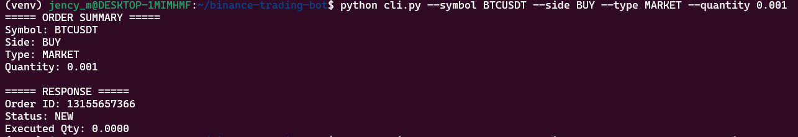
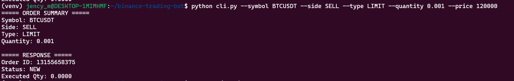
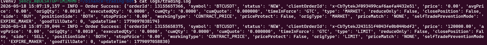

# Binance Futures Testnet Trading Bot

A simple Python CLI-based trading bot for Binance Futures Testnet (USDT-M).

This application supports:
- MARKET orders
- LIMIT orders
- BUY and SELL operations
- CLI-based order execution
- Input validation
- Logging
- Exception handling

---

# Project Structure

```bash
binance-trading-bot/
│
├── bot/
│   ├── client.py
│   ├── orders.py
│   ├── validators.py
│   ├── logging_config.py
│
├── logs/
│   └── trading.log
│
├── screenshots/
│   ├── market-order.png
│   ├── limit-order.png
│   └── logs.png
│
├── cli.py
├── requirements.txt
├── README.md
└── .env
```

---

# Features

- Place MARKET orders
- Place LIMIT orders
- BUY and SELL support
- Binance Futures Testnet integration
- Structured modular code
- Logging of API responses and errors
- Input validation
- Exception handling

---

# Setup Instructions

## 1. Clone Repository

```bash
git clone <your_repo_url>
cd binance-trading-bot
```

---

## 2. Create Virtual Environment

```bash
python3 -m venv venv
source venv/bin/activate
```

---

## 3. Install Dependencies

```bash
pip install -r requirements.txt
```

---

## 4. Configure API Keys

Create a `.env` file:

```env
API_KEY=your_api_key
API_SECRET=your_api_secret
```

---

# Usage

## MARKET Order Example

```bash
python cli.py --symbol BTCUSDT --side BUY --type MARKET --quantity 0.001
```

---

## LIMIT Order Example

```bash
python cli.py --symbol BTCUSDT --side SELL --type LIMIT --quantity 0.001 --price 120000
```

---

# Example Outputs

## MARKET Order



---

## LIMIT Order



---

## Logs



---

# Logging

Logs are stored in:

```bash
logs/trading.log
```

The application logs:
- successful API responses
- errors
- exceptions

---

# Assumptions

- Binance Futures Testnet account is active
- User has valid API credentials
- User has testnet balance available

---

# Technologies Used

- Python 3
- python-binance
- argparse
- python-dotenv
- logging

---

# Author

Jency M
